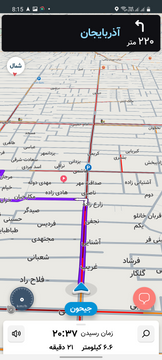

## Introduction
This project is developed for the [**Neshan** hiring challenge](https://docs.google.com/document/d/1Q7CXJ9NyzEYumL4R5HjbhH95LQZa2j8e96nMjjOOMEo). 

Application loads map on startup then starts to find user location and shows the accurate location on the map. User chooses a location as a destination on the map (check [**choose location module**](feature/choose_location) ). The application then gets a route from the user’s current location to the destination and displays the route shape on the map. After getting the route, the user can start navigation. And the user point starts moving on the route with constant speed.

You can download and test the application from **files** directory or just click on the link below.

[**click to download apk file**](https://raw.githubusercontent.com/aliarasteh/neshan-hiring-challenge-android/main/files/neshan-hiring-challenge.apk)


<br>
<p align="center">
 </p>

<br>


*  [App Structure](#structure)
*  [Technologies](#technologies)
*  [Setup And Run](#setup)
*  [Roadmap](#roadmap)
*  [Third Party Libraries](#libraries)
*  [License](#license)
*  [Contact](#contact)


### <a name="structure">App Structure</a> 

Although this is a simple project for test challenge purposes, It was assumed that it is part of a real app, hence is designed for a project with more features.
project is designed with a **modular architecture** which brings us great advantages in maintenance, testability, development speed, and code separation and readability.
here are modules defined in the app structure, you can see more detail about each module by selecting one.

- [app](app)
- core
  - [component](core/component)
  - [data](core/data)
- feature
  - [choose location](feature/choose_location)
  - other features


### <a name="technologies">Technologies</a>

- [**Kotlin**](https://kotlinlang.org/) used as main language offering great features like null-safety, extension functions and Coroutines
- [**Java**](https://docs.oracle.com/) language is chosen for implementing main app module
- Android recommended [app architecture](https://developer.android.com/topic/architecture) mostly known as **MVVM**
- [**Data Binding**](https://developer.android.com/topic/libraries/data-binding) library for binding UI components to data sources
- Using [**Hilt**](https://developer.android.com/topic/libraries/data-binding) library for dependency injection


### <a name="setup">Setup And Run</a> 

1. Clone the project:  

```sh
git clone https://github.com/aliarasteh/neshan-hiring-challenge-android.git
```

2. Define licence key and 

   - get your **License key** from [**Neshan**](https://developers.neshan.org/panel/access-token/index) 
   - place it in `neshan.license` file founded in directory:`src/main/res/raw/neshan.license`

3. Define neshan Api key

   - get your **API KEY** key from [**Neshan**](https://developers.neshan.org/panel/access-token/index)

   - place your key in `gradle.properties` file (recommended: use global `gradle.properties`)

```
NESHAN_API_KEY="your api key for neshan services"
```

4. Build and run project


### <a name="roadmap">Roadmap</a> 

- [x] implement base app structure and define architecture
- [x] create common tools and helper classes
- [ ] implement Neshan map navigation sample
  - [x] main map activity
  - [x] choose location activity
  - [ ] find and show direction on map
  - [ ] navigate to destination
  - [ ] write test cases (not completed)
- [x] documentation


### <a name="libraries">Third Party Libraries</a> 

here are third part libraries used in this sample

1. **Neshan** - Neshan map and navigation tools - [WebSite](https://platform.neshan.org/)
2. **Retrofit** - A type-safe HTTP client for Android and Java and great tool for networking - [GitHub](https://github.com/square/retrofit)
3. **RxJava** - Enables reactive programming in Android. used for handling network requests in Java - [GitHub](https://github.com/ReactiveX/RxJava)


### <a name="license">License</a> 

Distributed under the MIT License.


### <a name="contact">Contact</a> 
Ali Arasteh -  ali_arasteh@live.com - [LinkedIn](https://www.linkedin.com/in/aliarasteh/)


